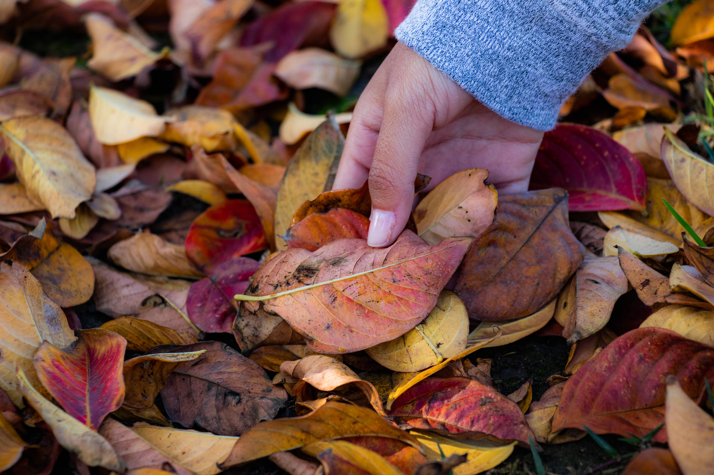

## Welcome to Tansi's Digital Portfolio 

This page is designed to showcase some photography I did while taking a Digital Photography course at my high school. Digital Photography was a class that I thoroughly enjoyed because it allowed me to use my creativity to capture some beautiful images and use editing softwares to further improve my photographs. 

### Nature

These picture were taken at Whintey High School under the afternoon light. Nature is a beautiful thing to capture with the power of a camera, and flowers, in particular, are my favorite things to take pictures of. The vibrancy of colors and the blur of the background can be done using photo editing softwares and can really enhance the image. Furthermore, the contrast in these images of the pink and green and the yellow and green adds to overall picture and makes it more appealing to the eye. 

Close-up images are really effective in capturing the small details and bringing life to the main subject in the picture. 

I think the true beauty of this image lies in the different colors and shades of the leaves that complement each other and the texture of the leaves as they look dried and crisp. 

### To view more images

In order to view more of my photography, such as black and white images, portraits, candids, nature, and food, visit [this](https://photography842.wixsite.com/tansigosalia) website.
